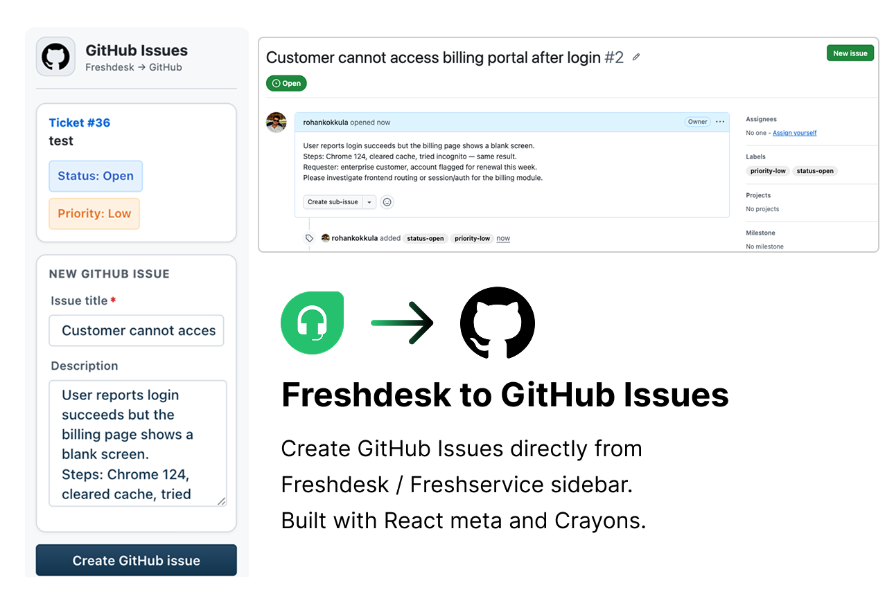

# Freshdesk to GitHub Issues

Create GitHub issues from Freshdesk or Freshservice ticket sidebars using OAuth and the Request method. Built with **React Meta** and **Crayons**.



## Features

- **Ticket sidebar** — create GitHub issues without leaving Freshdesk or Freshservice
- **Live ticket sync** — status and priority update when you change ticket properties
- **Editable issue form** — set title and description before creating the issue
- **OAuth to GitHub** — secure access via GitHub OAuth App
- **Linked issue view** — open the created issue on GitHub from the sidebar

---

## Configure GitHub

### Step 1 — Create a GitHub OAuth App

1. Sign in to GitHub and open **Settings → Developer settings → OAuth Apps → New OAuth App**.
2. Fill in the form:

| Field | Local development | Production (marketplace) |
| --- | --- | --- |
| **Application name** | e.g. `Freshdesk GitHub Issues (dev)` | e.g. `Freshdesk GitHub Issues` |
| **Homepage URL** | `http://localhost:10001` | Your app or company URL |
| **Authorization callback URL** | `http://localhost:10001/auth/callback` | `https://oauth.freshdev.io/auth/callback` |

3. Click **Register application**.
4. Copy the **Client ID**.
5. Click **Generate a new client secret** and copy the **Client secret** (shown once).

**Scopes:** The app requests **`repo`** so it can create issues in your target repository. The authorizing GitHub user must have write access to that repo.

**Tip:** For local dev, only `http://localhost:10001/auth/callback` is required. Add the Freshworks production callback before you publish to the marketplace.

### Step 2 — Prepare the target repository

1. Choose the repo where issues should be created (format: `owner/repo`, e.g. `my-org/product-backlog`).
2. Confirm the GitHub account you will authorize can **create issues** in that repo.
3. Optional: note a GitHub **username** to assign new issues to (installation iparam `github_assignee`).

### Step 3 — Run the app locally

```bash
npm install
fdk run
```

Keep this terminal running. Only one app can use port `10001` at a time.

### Step 4 — Complete installation settings

Open [http://localhost:10001/custom_configs](http://localhost:10001/custom_configs):

1. **GitHub OAuth Client ID** — paste from Step 1.
2. **GitHub OAuth Client Secret** — paste from Step 1.
3. Click **Authorize** and approve access on GitHub.
4. **GitHub repository** — enter `owner/repo` for the target repo.
5. **Default GitHub assignee** (optional) — GitHub username for new issues.

Save the installation page after all fields are set.

### Step 5 — Test in Freshdesk or Freshservice

1. With **`fdk run`** still running, open a ticket with **`?dev=true`**:
   - **Freshdesk:** `https://<your-domain>.freshdesk.com/a/tickets/<id>?dev=true`
   - **Freshservice:** `https://<your-domain>.freshservice.com/a/tickets/<id>?dev=true`
2. In the ticket **right sidebar**, open the **Apps** panel and select this app.
3. Review the ticket summary (status and priority stay in sync with the ticket).
4. Edit **Issue title** and **Description**, then click **Create GitHub issue**.
5. Use **Open issue on GitHub** to view the linked issue.

If the iframe is blank, allow **insecure localhost** in your browser (see Freshworks dev docs → Test your app).

---

## OAuth redirect URIs (Freshworks)

| Environment | Redirect URI |
| --- | --- |
| Local | `http://localhost:10001/auth/callback` |
| Production | `https://oauth.freshdev.io/auth/callback` |

---

## Troubleshooting

### App not visible

- **`fdk run` must be running** in this app folder (not another app on port `10001`).
- URL must include **`?dev=true`** (or `&dev=true`).
- Open the **Apps** section in the ticket sidebar.
- Restart **`fdk run`** after changing `manifest.json`.

### OAuth / `Failed to obtain access token`

- Client ID or secret is wrong — re-enter on `custom_configs` and authorize again.
- Callback URL in GitHub must match **`http://localhost:10001/auth/callback`** exactly for local dev.
- OAuth app owner must have access to the **github_repo** you configured.
- Stale local OAuth — stop `fdk run`, delete `.fdk/localstore`, run again, and re-authorize.

### Issue creation fails

- Confirm OAuth is authorized and **github_repo** is valid (`owner/repo`).
- Authorizing user needs **issue write** permission on the repo.
- Check browser console and `log/fdk.log` for API errors from GitHub.
